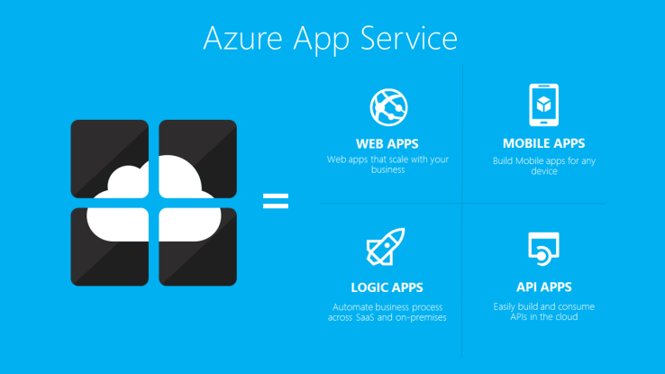
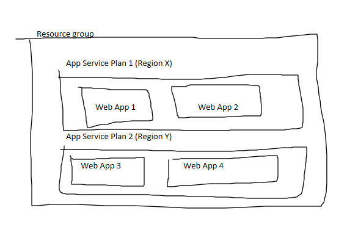
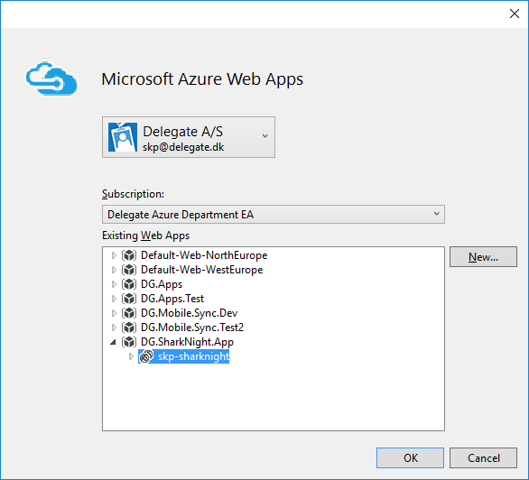

#Enviroment and Deployment



##Enviroment



* A App Hosting Plan plan can only be associated one resource group
* The App Hosting plan defines the cost of running the web site(s)
* A Web App can only be associated with one web hosting plan at any given time
* Web Apps can be moved between web hosting plans (within the same ressource group and region)

###Task 1 - How to structure your enviroment
Would you place multiple different web apps in the same app hosting plan? 


##Deployment
###Deploy a Web Application from Visual Studio
Now the infrastructure is ready and we can deploy our application. 

- In Visual Studio, right click the a web application and select publish
- Select Microsoft Azure Web Apps
- Select the Web App you created in step 4 

- Visual Studio will now download the publishing settings file (which you also can download from the azure portal) and setup web deploy with the credentials from the file.
- Click to the final step of the wizard and click publish 

###Deployment from PowerShell
```
Publish-AzureWebsiteProject
```

###Continues Deployment with the Azure App Service tools
I would strongly discourage you from using this method, because personally I think you should have a deploy package that so you know exactly what is deployed. 
And not have the web app build its own code.

But it could be useful in e.g. dev scenarios or for simple solutions

### Continues Deployment from External Build Pipeline
Yes yes yes do this. E.g. use Release Management in TFS (not available in our TFS yet, will be when Update 2 is installed, https://www.visualstudio.com/en-us/news/tfs2015-update2-vs.aspx)

###Task 2 - Deploy something
Pick a method of deployment you haven't used before
 
