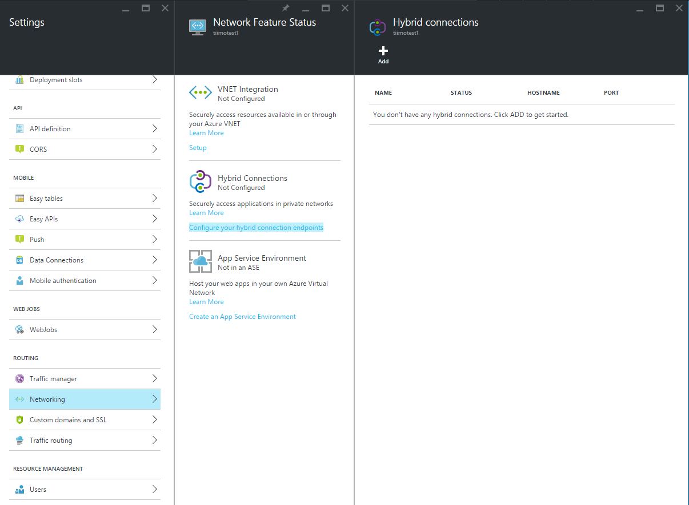
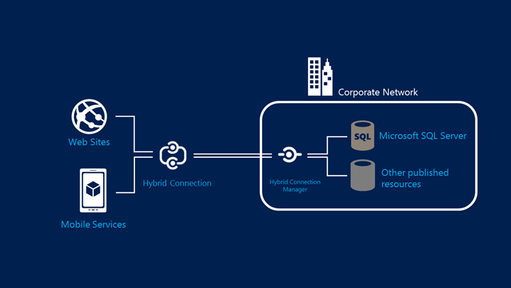

#Azure Web App Networking
Azure Web Apps can be connected to either a Virtual Network in Azure via a Point to Site VPN or you can connect the site to your on prem enviroment by installing a connector (Service Bus Relay Agent)

Finally theres an option to run your web apps in a App Hosting Environment, that ensures all sites are on machine in a virtual network you create. 

##Hybrid Connection 

https://azure.microsoft.com/en-us/documentation/articles/integration-hybrid-connection-overview/ 

###Task 1
Try to setup a SQL a Hybrid Connection to your Dev Machine, if you have a SQL server installed. 
https://azure.microsoft.com/en-us/documentation/articles/web-sites-hybrid-connection-connect-on-premises-sql-server/ 

You can read my blog post on the topic if you get stuck, note the part about the connection string.
http://wp.sjkp.dk/connect-azure-hybrid-connection-to-sql-express/ 

###Task 2 - When would you advice customers to use the hybrid connection technology?
