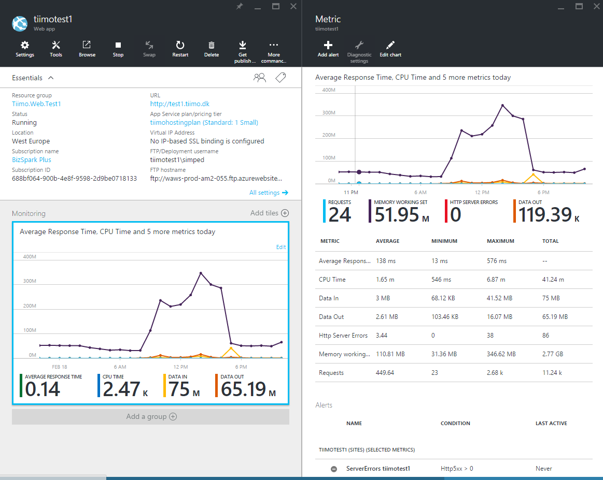

#Value Adds
Why use Azure App Services over e.g. Cloud Services or a VM? Because of all the extras you get.

* No patching
* Comparable pricing
* Scaling
* Monitoring
* Easy backup
* Extra slots
* Web Jobs
* Mobile Services
* Extensions

On the downside
* You are not in control of what is installed on the server
* GDI support is limited (e.g. many PDF tools and other screen printers wont work)
* You are vendor locked to Azure (at least when you start using the value adds) - if you dislike that, go with docker. 


##Scale 
Scaling happens at the hosting plan level. 

###Task 1 - Scale up vs Scale out
What type of scaling strategy would you go for? 

###Auto-scale
Use with caution. 

It works however. E.g. read http://www.troyhunt.com/2015/02/stories-from-trenches-sizing-and-penny.html 


##Monitoring


###Alerts 
Setup alerts on app hosting plan or on web app
* Memory
* Response times
* HTTP Errors
* CPU 

Send emails or call web hooks - use it it's free, be proactive. 

##Easy backup 
Backup lets you store all the files on the web server in blob storage. Either you manually backup the files or you setup a job to do it. 

Why do you need it? Because if you do a failed deploy or someone else does thing to your site you can get back to a known good state. 

###Task 2 - Setup backup
Try to setup a backup routine for your site.


##Extra Web App Slots
Web App Slots are multiple application pools running on the same web site in different verions. Each slot can have it's own settings. 

###Task 3 - What can we use slots for? 
Any takers? 


##Important application settings
* 32 vs 64bit
* Always on
* Debugging (if you need to connect the remote debugger, not relevant in VS2015, it asks for it to be enabled if it isn't)
* Auto swap
Add the following to the web.config if specific urls have to be hit as part of the warm up
```
<applicationInitialization>
    <add initializationPage="/" hostName="[web app hostname]" />
    <add initializationPage="/Home/About" hostname="[web app hostname]" />
</applicationInitialization>
``` 
https://azure.microsoft.com/en-us/documentation/articles/web-sites-staged-publishing/#configure-auto-swap-for-your-web-app 

###Task 4 - When would you use 64 bit? 

##Web Jobs
Run background tasks in Azure very easy to use and very powerfull. We will do a seperate session on this. 

##Mobile Services 
Seperate session, but probably not highly relevant

##Site Extensions
Site extensions is a way to extend Azure Web Apps with extra functionality. It is very niche, but sometimes it can be useful. 
https://siteextensions.net/ 

###Task 5 - Install a site-extension
Visit the kudu management portal for your site. https://<yoursite>.scm.azurewebsites.net and install a site extension

A site extensions can contain changes to the [applicationHost.xdt](https://github.com/projectkudu/kudu/wiki/Xdt-transform-samples) file, and/or install a seperate web app in the scm site. Most of them requires the scm site to be restarted before working.

###Interesting extenions
* [Testing in production](https://www.siteextensions.net/packages/TiPCallback/)
* [Lets Encrypt SSL Certificates](https://www.siteextensions.net/packages/letsencrypt/)
* [Reverse Proxy](https://www.siteextensions.net/packages/reverseproxy/)

It would probably be easy to make something cool with F# and site-extensions, e.g. make hosting F# easier or better on Azure Web Apps


