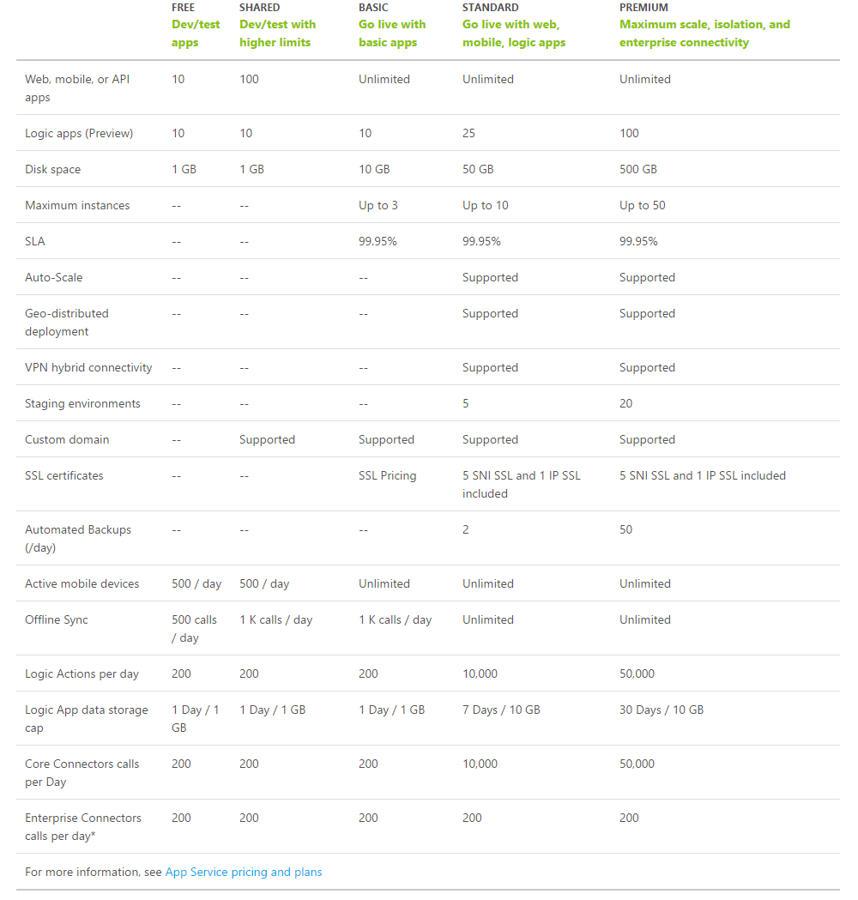

#Azure App Service Pricing and Features

For pricing information always take the updated info from https://azure.microsoft.com/en-us/pricing/details/app-service/

Or use the EA excel calculator (we need an updated version, a Microsoft sales person should be able to get it) https://www.yammer.com/delegate.dk/uploaded_files/29695080 
 

## What to pick
Anything below basic should be avoided for production loads. 

##Task 1 
A fairly simple setup for a web app environment cloud look like this: 

* Prod environment 
* Test environment 
* Dev enviroment 

Lets assume a single standard instance is enough for production, what would you select for the other enviroments. 

What would the total price be in Western Europe? 

##Task 2 - Lets deploy stuff
###Manually
Use https://portal.azure.com (Don't use the old portal for App Services)
###Automated
https://github.com/Azure/azure-quickstart-templates/tree/master/201-web-app-github-deploy 
###Try App Services
https://tryappservice.azure.com/ 