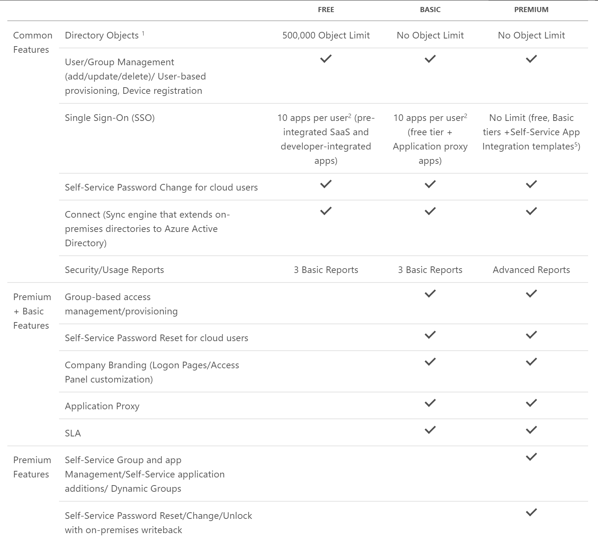

# Azure AD - Pricing
https://azure.microsoft.com/en-us/pricing/details/active-directory/ 

* Free
* Basic (EA/Office 365)
* Premium (EA/Buy through Azure)

##Basic
 * Branding
 * Self-service password reset
 
##Premium
* Multifactor (MFA) included
* Password write back
* Dynamic groups
* [Cloud App Discovery](https://azure.microsoft.com/en-us/documentation/articles/active-directory-cloudappdiscovery-whatis/)
* MDM (Mobile Device Management)
* [AD Connect Health](https://azure.microsoft.com/en-us/documentation/articles/active-directory-aadconnect-health/)

 ##Preview
 * [Azure AD Identity Protection](https://azure.microsoft.com/en-us/documentation/articles/active-directory-identityprotection/)
 Installable from the Azure marketplace
 Only available if Azure AD region is US

##Task 1
Is it relevant what Azure AD SKU our clients use from a developer stand point of view? 