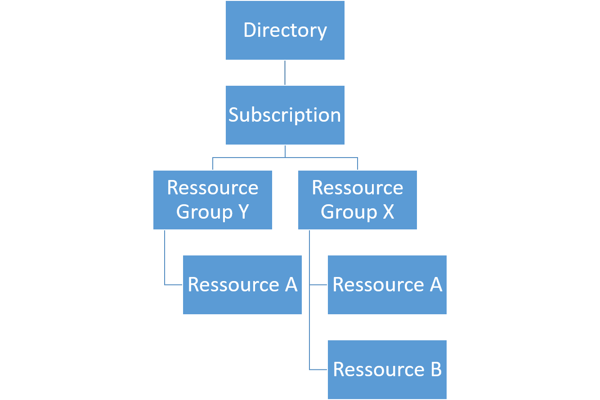

#Azure Role Based Access Control

* Owner
* Contributor
* Reader

##Resource Specific Roles
* "Microsoft.Compute/*/read",
* "Microsoft.Compute/virtualMachines/start/action",
* "Microsoft.Compute/virtualMachines/restart/action",

Only supported by ARM 

The heirachy looks like

https://azure.microsoft.com/sv-se/documentation/articles/role-based-access-control-configure/

##Task - Assign access to a service principal
The service principal created earlier can be assigned access to a specific Azure Resource. 

Why could that be useful? 

##Custom Roles
It is also possible to create custom Role definitions. 

##Task - Custom Role Definitions
Give an example of when a custom role definition could make sense? 