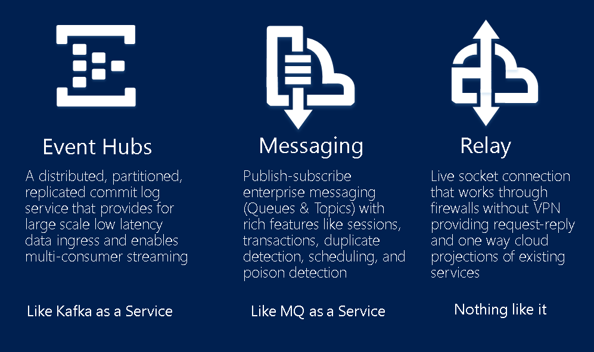
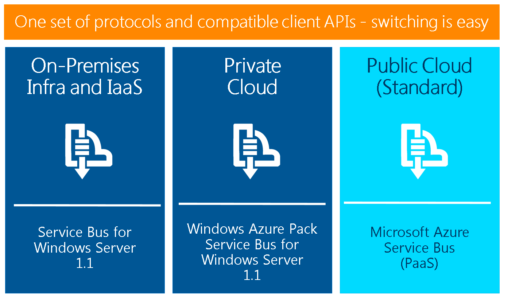
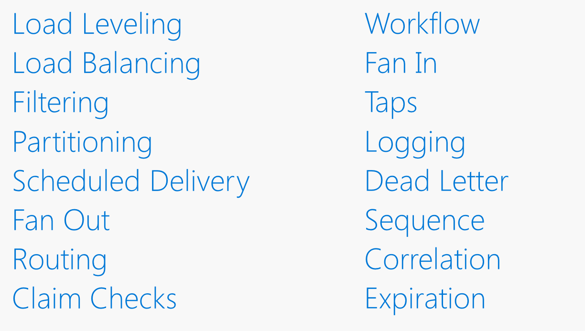

# Azure Servie Bus - General

## What is Azure Service Bus
* Azure Messaging 
* Event Hub
* Relay Agent





### Question
Do you know of any other services like it? 

## What can we do with Azure Service Bus


### Question
Why not use Azure Storage Queues? 

Remember last time?
https://github.com/sjkp/Delegate.Azure.Team/blob/master/20160407-azure-web-jobs/azure-storage-and-service-bus-queues.md#azure-storage-queues-vs-service-bus-queues 

## Service Bus Structure

The service bus services are structured in a strange way compared to other Azure Services. Basically there are two types of Service bus namespaces, both a total of 5 resource types you can create, which makes it a little confusing. 

A namespace is simply a url, e.g. sjkptestrelay.servicebus.windows.net 

The two types of namespace are:

* Messaging
 * Queues
 * Topics
 * Event Hub
 * Relay Agent
* Notification Hub


## Secure Access to Service Bus 
Service Bus uses, Shared Access Signatures (SAS) for authentication (the same technique that can be applied to Azure Storage). 

Two components are in use when using SAS, a Shared Access Policy (policy), and a Shared Access Signature (token). 

A token is always linked to a policy. 

To create a policy you need three pieces of information: 

* name - a name for the policy indicating what the it is intended to be used for
* scope - the scope the permission applied to, can be the namespace, or a specific service within the namespace (topic/queue)
* permission level - only three levels are available, Send, Listen and Manage

When you create a new namespace you always get a policy on the namespace itself named `RootManageSharedAccessKey`, this is the key to your kingdom, so don't *ever* use it in applications! Always create new SAS tokens, with the appropiate permissions and appropiate scope. 

Do note that you can only have up to 12 policies for any given resource type (e.g. topic, queue) (with the amount of permissions levels, this should be more than enough)

Each policy have a primary and a secondary key can be used to generating the SAS tokens

### Question 
1. Can you design a multi client application where each client have use their own policy to generate their SAS tokens? 
2. Why is having two keys useful? 
3. What happens with tokens when we regenerate the key that was used to generate the token? 


### Generating tokens/Shared Access Signatures
The policy itself is not the access token for Service Bus. It is the object from which the access token is generated. 

You can use the SDK to generate the SAS token or you can do it manually. 

The SAS token has the following format 

`SharedAccessSignature sig=<signature-string>&se=<expiry>&skn=<keyName>&sr=<URL-encoded-resourceURI>`

To generate it in C# use

```CSharp
private static string createToken(string resourceUri, string keyName, string key)
{
    TimeSpan sinceEpoch = DateTime.UtcNow - new DateTime(1970, 1, 1);
    var week = 60 * 60 * 24 * 7;
    var expiry = Convert.ToString((int)sinceEpoch.TotalSeconds + week);
    string stringToSign = HttpUtility.UrlEncode(resourceUri) + "\n" + expiry;
    HMACSHA256 hmac = new HMACSHA256(Encoding.UTF8.GetBytes(key));
    var signature = Convert.ToBase64String(hmac.ComputeHash(Encoding.UTF8.GetBytes(stringToSign)));
    var sasToken = String.Format(CultureInfo.InvariantCulture, "SharedAccessSignature sr={0}&sig={1}&se={2}&skn={3}", HttpUtility.UrlEncode(resourceUri), HttpUtility.UrlEncode(signature), expiry, keyName);
    return sasToken;
}
```

### Call Service Bus

To access service bus resource with the token it has to be provided in the HTTP header like so

```
POST https://<yournamespace>.servicebus.windows.net/<yourentity>/messages
Content-Type: application/json
Authorization: SharedAccessSignature sr=https%3A%2F%2F<yournamespace>.servicebus.windows.net%2F<yourentity>&sig=<yoursignature from code above>&se=1438205742&skn=KeyName
ContentType: application/atom+xml;type=entry;charset=utf-8
```

Of course you would probably use the SDK and not do it manually. https://www.nuget.org/packages/WindowsAzure.ServiceBus/

Read more on this topic [here](https://azure.microsoft.com/en-us/documentation/articles/service-bus-sas-overview/) and [here](https://azure.microsoft.com/en-us/documentation/articles/service-bus-shared-access-signature-authentication/):
    

## Service Protocol
Service bus supports HTTP and AMQP for messaging. 

AMQP is a open standard. 

*    **Efficient**: AMQP 1.0 is a connection-oriented protocol that uses a binary encoding for the protocol instructions and the business messages transferred over it. It incorporates sophisticated flow-control schemes to maximize the utilization of the network and the connected components. That said, the protocol was designed to strike a balance between efficiency, flexibility and interoperability.
*    **Reliable**: The AMQP 1.0 protocol allows messages to be exchanged with a range of reliability guarantees, from fire-and-forget to reliable, exactly-once acknowledged delivery.
*    **Flexible**: AMQP 1.0 is a flexible protocol that can be used to support different topologies. The same protocol can be used for client-to-client, client-to-broker, and broker-to-broker communications.
*    **Broker-model independent**: The AMQP 1.0 specification does not make any requirements on the messaging model used by a broker. This means that it's possible to easily add AMQP 1.0 support to existing messaging brokers.

To use AMQP use the right connection string
`
Endpoint=sb://[namespace].servicebus.windows.net/;SharedAccessKeyName=RootManageSharedAccessKey;SharedAccessKey=[SAS key];TransportType=Amqp
`


https://azure.microsoft.com/en-us/documentation/articles/service-bus-amqp-overview/